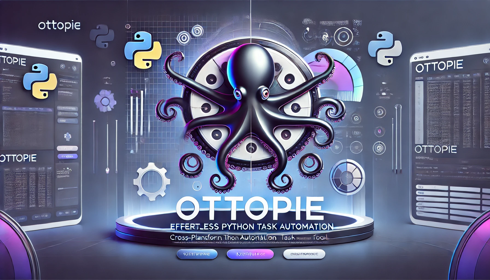

### OttoPie - 自动化 Python 任务管理平台 🐙🥧




**OttoPie** 是一款跨平台的 Python 自动化任务管理工具。它的名字来源于 "Otto"（八爪鱼 🐙，谐音Auto ，代表多任务与自动化）和 "Pie"（谐音派，Python 🥧，代表 Python 生态）。OttoPie 让你像八爪鱼一样灵活管理多个 Python 自动化任务，并提供图形化界面、定时调度、脚本管理和日志记录等功能。

---

## ✨ 功能特点

- **📋 脚本管理**：支持加载、删除、配置 Python 脚本，让任务管理更直观。
- **⏳ 任务调度**：支持定时执行 Python 脚本，自动化处理日常任务。
- **📂 文件监控**：可结合插件脚本，实现对文件夹变化的实时监控。
- **🖥️ 图形界面**：基于 PyQt 构建，无需命令行即可操作。
- **💾 任务日志**：集中记录脚本运行日志，方便查看执行状态。
- **🎛️ 插件式架构**：支持自定义 Python 插件，只需实现简单的接口，即可轻松扩展功能。

---

## 🚀 安装与运行

### 1️⃣ 安装依赖

OttoPie 基于 Python 3 运行，请确保已安装 Python 3.x，并执行以下命令安装依赖：

```sh
pip install pyqt5
```

> 如果使用 PySide2，请替换为 `pip install pyside2`。

### 2️⃣ 运行 OttoPie

在终端或命令行中执行：

```sh
python main.py
```

---

## 🏗️ 使用指南

### 1️⃣ 添加任务

1. 打开 OttoPie，进入“脚本管理”页面。
2. 点击 **“添加任务”** 按钮，弹出脚本配置窗口：
   - 选择 Python 任务脚本（`.py` 文件）。
   - 选择 **源文件夹** 和 **目标文件夹**（如果任务需要）。
   - 设置 **执行间隔**（以秒为单位）。
3. 点击 **确定**，任务会添加到任务列表中。

### 2️⃣ 启动 / 停止任务

- 在“脚本管理”页面，点击 **“启动”** 按钮，任务将按照设定的间隔执行。
- 点击 **“停止”** 按钮，可暂停任务执行。

### 3️⃣ 编辑任务配置

- 点击 **“编辑配置”** 按钮，可重新配置脚本参数。
- **编辑时任务会自动停止**，修改完成后可重新启动任务。

### 4️⃣ 删除任务

- 点击 **“删除”** 按钮，可移除任务（不会删除脚本文件）。

### 5️⃣ 查看日志

- 切换到 **“任务日志”** 选项卡，查看任务的运行状态和历史记录。

---

## 🔌 开发自定义插件（Python 任务脚本）

OttoPie 采用 **插件化架构**，每个 Python 任务脚本需要实现 `run(params)` 接口，OttoPie 会定期调用 `run()` 运行任务。

### 📜 插件示例：simpletask.py

在本项目中，我们提供了一个示例脚本 **simpletask.py**，用于展示如何实现插件接口。该示例脚本实现了以下功能：

- **文件监控与拷贝**：  
  脚本会监视指定的源文件夹，将符合条件的图片文件复制到目标文件夹中。  
- **目录结构保留**：  
  在拷贝过程中，保留源文件夹中的子目录结构，使目标文件夹成为源文件夹的镜像。  
- **同步操作**：  
  当源文件夹中的文件发生更新或删除时，目标文件夹也会随之更新或删除，实现两者的完全同步。

示例代码如下：

```python
import os
import shutil

def sync_folders(src, tgt, counters):
    """
    递归同步 src 与 tgt 文件夹，使 tgt 成为 src 的完整镜像。
    
    参数：
      - src: 源文件夹路径
      - tgt: 目标文件夹路径
      - counters: 用于统计操作次数的字典，包含 'copied', 'updated', 'deleted', 'skipped'
    """
    # 确保目标文件夹存在
    if not os.path.exists(tgt):
        os.makedirs(tgt)
    
    # 1. 遍历源文件夹，处理新增和更新
    for entry in os.listdir(src):
        src_entry = os.path.join(src, entry)
        tgt_entry = os.path.join(tgt, entry)
        if os.path.isdir(src_entry):
            # 递归同步子文件夹
            sync_folders(src_entry, tgt_entry, counters)
        else:
            # 如果目标中不存在该文件，则拷贝
            if not os.path.exists(tgt_entry):
                shutil.copy2(src_entry, tgt_entry)
                counters["copied"] += 1
            else:
                # 如果目标中存在，但源文件更新，则覆盖
                if os.path.getmtime(src_entry) > os.path.getmtime(tgt_entry):
                    shutil.copy2(src_entry, tgt_entry)
                    counters["updated"] += 1
                else:
                    counters["skipped"] += 1

    # 2. 遍历目标文件夹，删除那些在源文件夹中不存在的文件或目录
    for entry in os.listdir(tgt):
        tgt_entry = os.path.join(tgt, entry)
        src_entry = os.path.join(src, entry)
        if not os.path.exists(src_entry):
            # 如果目标中的该条目在源中不存在，则删除
            if os.path.isdir(tgt_entry):
                shutil.rmtree(tgt_entry)
            else:
                os.remove(tgt_entry)
            counters["deleted"] += 1

def run(params):
    """
    同步任务接口，必须实现 run(params) 接口。
    
    参数 params 为字典，必须包含：
      - "src": 源文件夹路径
      - "tgt": 目标文件夹路径
      
    返回字符串，描述操作结果。
    """
    src = params.get("src", "").strip()
    tgt = params.get("tgt", "").strip()
    
    if not src or not tgt:
        return "错误：请指定源文件夹和目标文件夹。"
    if not os.path.isdir(src):
        return "错误：源文件夹不存在。"
    
    counters = {"copied": 0, "updated": 0, "deleted": 0, "skipped": 0}
    
    try:
        sync_folders(src, tgt, counters)
        return ("同步完成：复制文件 {copied} 个，更新文件 {updated} 个，删除文件 {deleted} 个，跳过 {skipped} 个文件。"
                .format(**counters))
    except Exception as e:
        return "同步过程中发生错误: " + str(e)
```

#### 📌 插件规范

- **必须实现 `run(params)` 函数**。  
- `params` 参数是一个 Python 字典，包含任务配置，如 `src`（源文件夹）和 `tgt`（目标文件夹）。  
- **返回值必须是字符串**，用于日志记录。  
- 示例脚本 **simpletask.py** 展示了如何实现文件的新增、更新和删除同步，确保目标文件夹始终与源文件夹保持一致。

---

OttoPie 仍在持续开发中，欢迎贡献代码、报告问题或提出新功能建议！  
如果你有兴趣，可以 Fork 本项目并提交 Pull Request 🚀。

---

## 📜 许可证

OttoPie 遵循 MIT 许可证，你可以自由使用、修改和分发本软件。

---

OttoPie，让你的 Python 任务自动化管理变得更简单！🐙🥧

---

以上即为 OttoPie 的使用说明与示例脚本介绍，帮助你快速上手并开发更多自定义插件。